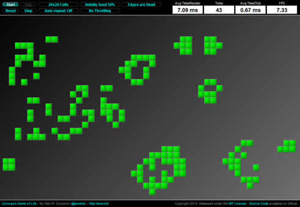

Conway's Game of Life
------

I haven't written Conway's Game of life in probably something like 25 years.  I remember writing my first version for a TRS-80 "Trash 80" Model 3, probably using BASIC.  I think I also wrote a version in Pascal at one point and another version in Modula-2.  But it's been at least two decades since I wrote it and I was curious to see how it would shape up in JavaScript and how it would run in the Browser.

In particular, I knew the biggest problem for writing this in JS would be in rendering performance time, especially if we are relying on the DOM for each cell element. So, the challenge lay in not so much writing the program, but how to make it performant in the browser.

So, here's what I came up with. You can run this at my website [http://arei.net/dev/GameOfLife](http://arei.net/dev/GameOfLife) or download the source code and open it on your own local machine.

Also, if you want to take it out and make some tweaks, see if you can get better performance, I'd love to see your fork. Let me know!

Enjoy.

